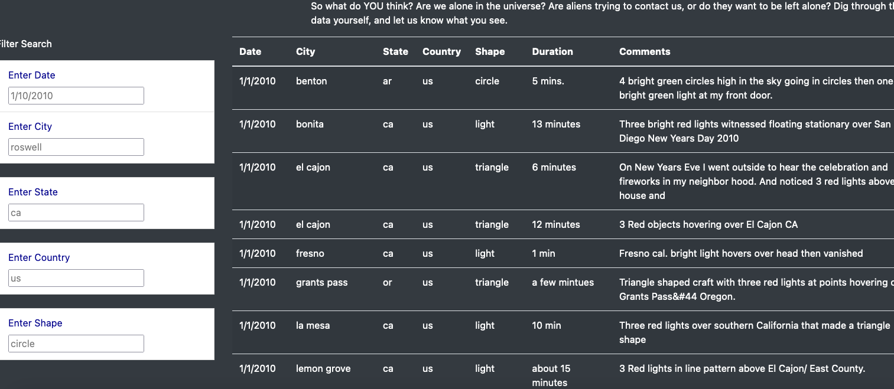

# UFOS
Using Javascript, bootstrap to add to Dana's webpage and to provide a more in-depth analysis of UFO sightings by allowing users to filter for multiple criteria at the same time. 

# Overview of the Project

To projected consisted of builind an HTML page to pull up information using javascript data. Using various filters to narrow down UFO sightings that occured in the U.S. 

# HTML Page

When you enter the website you will see the basic opening and title, as you scroll down you will begin to see all the data and filters. 

# Summary

The page has been created allows users to filter through 5 different settings using the data set provided. 
